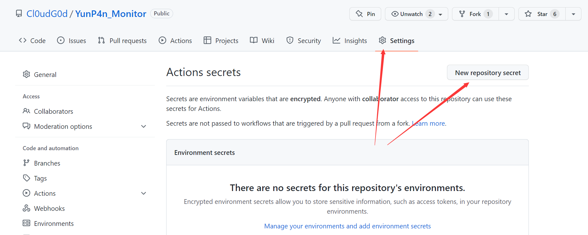
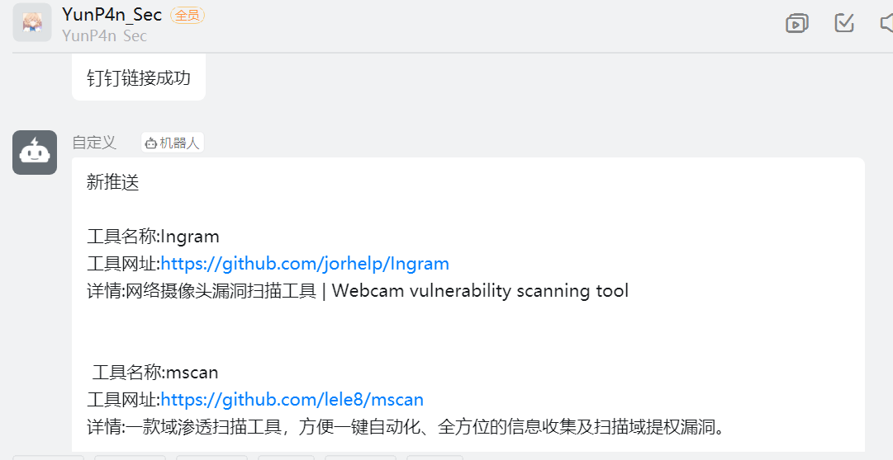
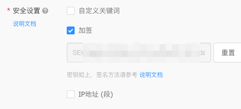

# YunP4n_Monitor
Github关键字监控，并通过Github Actions自动推送到钉钉

用Github Actions只是因为没VPS :)

## 使用方式
fork仓库 [https://github.com/Cl0udG0d/YunP4n_Monitor](https://github.com/Cl0udG0d/YunP4n_Monitor) 之后

必须进行的配置：



新增两个隐私变量：

+ DINGDING_SECRETKEY
+ DINGDING_WEBHOOK

对应钉钉自定义群助手的接口值，这样操作是为了防止隐私泄露

如果想要修改关键字参数，只需要修改`main.yml`文件中的keywords 参数即可

- keywords 你需要监控的关键字们，空格隔开就行

如果想要修改推送的时间，修改这部分就行

```yaml
on:
  schedule:
    - cron: '*/5 * * * *'
```

然后就能愉快使用了

## 使用效果



## 推送方式
目前仅支持钉钉，如果有能力的师傅欢迎提交PR

### 钉钉设置

1.   建立群聊（可以单人建群）

2.   智能群助手添加自定义机器人

选择加签



## 编写原理
[对Github指定类目的内容进行监控和推送](https://www.cnblogs.com/Cl0ud/p/16631445.html)

### END 

建了一个微信的安全交流群，欢迎添加我微信备注`进群`，一起来聊天吹水哇，以及一个会发布安全相关内容的公众号，欢迎关注 :)

<div>
    
    
</div>